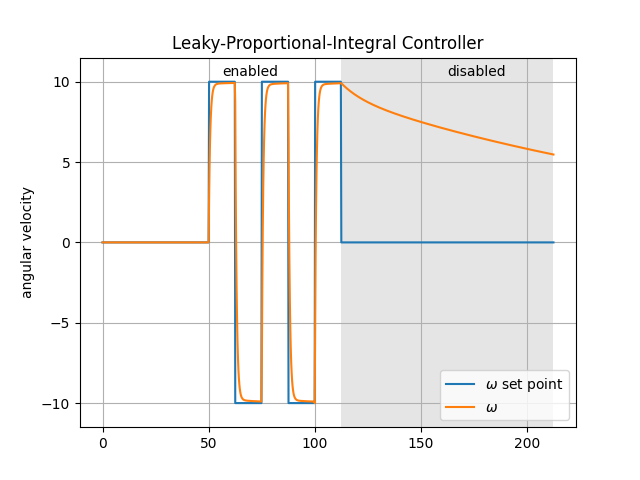
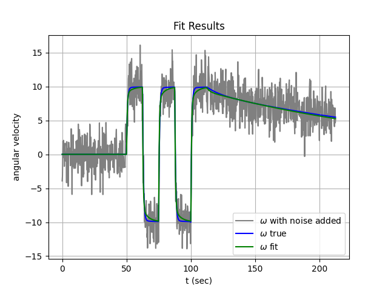

## lpi-control-demo

A simple example demonstrating a Leaky-Proportional-Integral controller. 

## Installation
The packaged can be installed with poetry or with pip. 

To install using poetry 
```bash
poetry install
```

To install using pip. 
```bash
pip install .
```
Use the -e option for an editable (develop) install. 




---




